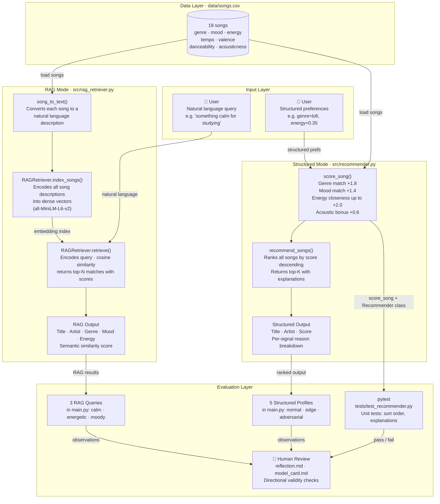

# System Diagram: VibeFinder with RAG

## Component Descriptions

| Component | File | Role |
|---|---|---|
| **song_to_text()** | `src/rag_retriever.py` | Converts a song dict to a text description for embedding (e.g. `"Library Rain by Paper Lanterns - lofi chill very low energy acoustic"`) |
| **RAGRetriever.index_songs()** | `src/rag_retriever.py` | Pre-encodes all 18 songs into dense vectors using `all-MiniLM-L6-v2` at startup |
| **RAGRetriever.retrieve()** | `src/rag_retriever.py` | Encodes the natural language query, runs cosine similarity against song embeddings, returns top-N matches |
| **score_song()** | `src/recommender.py` | Rules-based scorer — awards weighted points for genre, mood, energy closeness, and acoustic preference |
| **recommend_songs()** | `src/recommender.py` | Scores every song in the catalog, sorts descending, returns top-K with per-signal explanations |
| **Recommender class** | `src/recommender.py` | OOP wrapper used by unit tests — delegates to `score_song()` internally |
| **data/songs.csv** | `data/` | Knowledge base — 18 songs, 10 features each — shared by both modes |
| **pytest** | `tests/` | Automated unit tests for sort order and explanation correctness |
| **Human Review** | `reflection.md`, `model_card.md` | Manual evaluation of directional validity across profiles |
