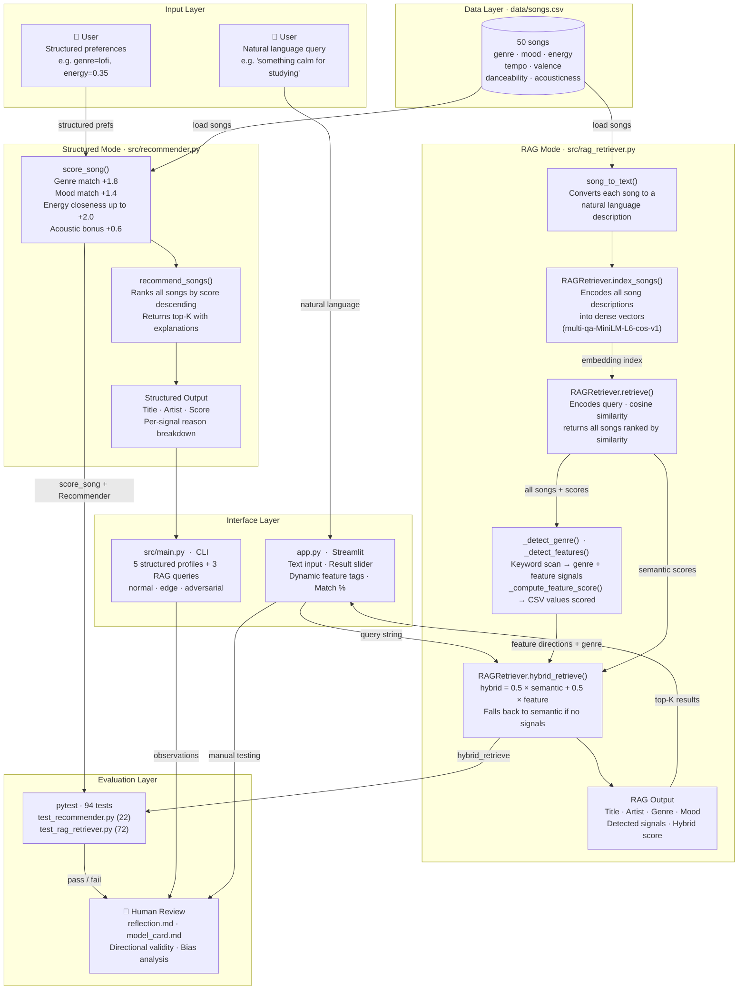

# System Diagram: VibeFinder with RAG

## Component Descriptions

| Component | File | Role |
|---|---|---|
| **song_to_text()** | `src/rag_retriever.py` | Converts a song dict into a full natural language sentence for embedding (e.g. `"Library Rain by Paper Lanterns is a calm and relaxed acoustic lo-fi track with low energy. ideal for studying, focusing, or winding down."`) |
| **RAGRetriever.index_songs()** | `src/rag_retriever.py` | Pre-encodes all 50 songs into dense vectors using `multi-qa-MiniLM-L6-cos-v1` (asymmetric query-document model) at startup |
| **RAGRetriever.retrieve()** | `src/rag_retriever.py` | Encodes the natural language query, runs cosine similarity against song embeddings, returns top-N matches with scores |
| **RAGRetriever._detect_genre()** | `src/rag_retriever.py` | Scans query for genre keywords (longest-match-first to prevent partial matches); returns the matched CSV genre string or None |
| **RAGRetriever._detect_features()** | `src/rag_retriever.py` | Scans query for feature keywords mapped to CSV columns (energy, valence, danceability, acousticness, tempo_bpm); checks negative signals before positive to handle phrases like "low energy" correctly |
| **RAGRetriever._compute_feature_score()** | `src/rag_retriever.py` | Scores a song's CSV numeric values against detected feature directions (+1/-1); normalizes tempo_bpm to [0,1]; adds binary genre match (1.0/0.0); averages all active signals |
| **RAGRetriever.hybrid_retrieve()** | `src/rag_retriever.py` | Combines semantic similarity and feature score: `hybrid = 0.5 × semantic + 0.5 × feature_score`; falls back to pure semantic when no signals detected |
| **score_song()** | `src/recommender.py` | Rules-based scorer — awards weighted points for genre (+1.8), mood (+1.4), energy closeness (up to +2.0), and acoustic preference (+0.6) |
| **recommend_songs()** | `src/recommender.py` | Scores every song in the catalog, sorts descending, returns top-K with per-signal explanations |
| **Recommender class** | `src/recommender.py` | OOP wrapper used by unit tests — delegates to `score_song()` internally |
| **app.py** | `app.py` | Streamlit web UI — caches the retriever with `@st.cache_resource`, accepts natural language queries, displays dynamic per-song tags based on detected signals |
| **data/songs.csv** | `data/` | Knowledge base — 50 songs, 10 features each — shared by both modes |
| **pytest** | `tests/` | 94 automated unit tests across `test_recommender.py` (22) and `test_rag_retriever.py` (72); RAG tests use identity-matrix mock embeddings — no model download required |
| **Human Review** | `reflection.md`, `model_card.md` | Manual evaluation of directional validity; model card covers limitations, bias, misuse, and AI collaboration |
