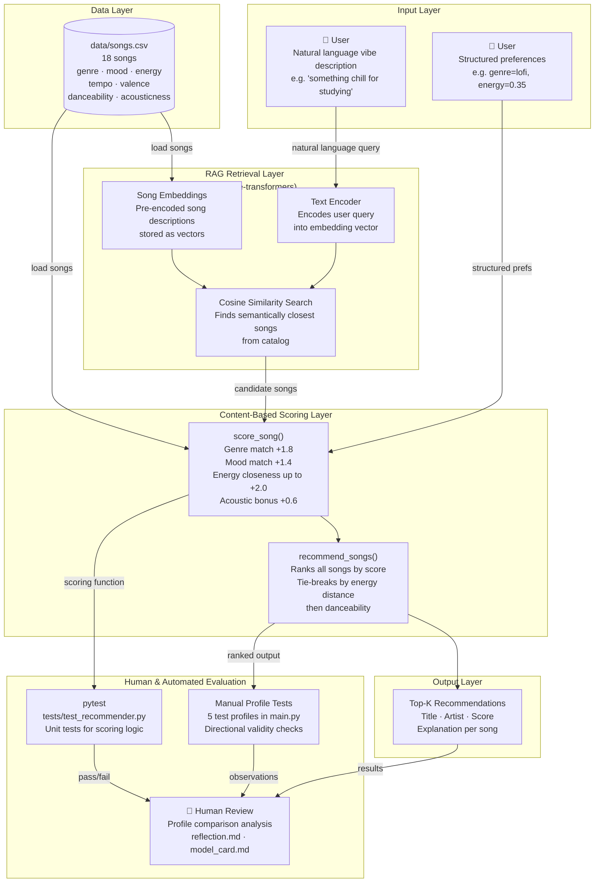

# System Diagram: VibeFinder 1.0 with RAG

## Component Descriptions

| Component | Role |
|---|---|
| **Text Encoder** | Converts natural language input into a dense vector using `sentence-transformers` (`all-MiniLM-L6-v2`) |
| **Song Embeddings** | Pre-encoded text representations of each song's features, enabling semantic search |
| **Cosine Similarity Search** | RAG retrieval step — finds songs whose meaning is closest to the user's query |
| **score_song()** | Rules-based scorer applying weighted feature matching against a structured UserProfile |
| **recommend_songs()** | Aggregates scores, ranks, and returns top-k results with explanations |
| **data/songs.csv** | Knowledge base — 18 songs with 10 features each |
| **pytest** | Automated unit tests for scoring correctness |
| **Human Review** | Manual profile comparison and model card evaluation by a person |
| **Manual Profile Tests** | 5 hardcoded test profiles in main.py used to check directional validity |
